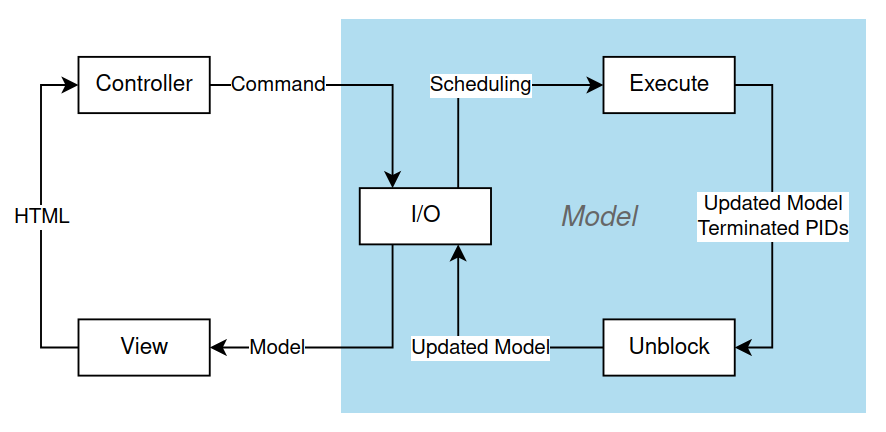

\tableofcontents

\newpage

# Introduction

occam is a high-level procedural programming language, designed to support concurrent applications. Based on the Communicating Sequential Processes (CSP) algebra, it models programs as parallel processes communicating via blocking (synchronous) channels.

It is suitable for an introduction to practical concurrent programming, as it natively supports concurrent processes and represents them intuitively as adjacent blocks of code, placed in a hierarchy by the use of significant whitespace (i.e. indentation changes the meaning of code). The use of channels makes the connections between processes explicit. It may also be useful for teaching theoretical computer science - its strong resemblance to CSP makes it a possible alternative to trace refinement checking tools for gaining intuition of how processes interact in a message-passing paradigm.

This project presents a browser-based interpreter for occam ("BrowserOccam"), intended for use in teaching concurrent programming concepts. A parser, lexer, interpreter and user interface were all created. BrowserOccam implements the majority of occam 1, including variables, arithmetic and logical operators, control structures, parallel and sequential code blocks, and channels. The language is extended with keyboard input, serial output, and a colourful graphics display in order to make it interactive. Arrays of variables and channels were also added.

Parallel execution is simulated via a pseudo-random scheduler to emphasise the non-deterministic order of events. The unbounded number of parallel processes are modelled as two lists, one of running processes and another of processes that block until a channel event or process termination. Processes have unique IDs and an inheritance system to track when all sub-processes have terminated.

A user study was conducted to evaluate BrowserOccam, and it was found to be a realistic tool for teaching beginners about concurrent programming concepts and channels. Users were able to pick up occam and complete coding and code comprehension tasks in BrowserOccam without the need for long explanations or outside support. They enjoyed the interactive and graphical aspects, and agreed that the interface was intuitive and helpful. Further work could be carried out to extend the project, by writing up a full course of learning exercises, writing more helpful error messages which suggest solutions to common issues, and adding a way to display the concrete efficiency improvements that can be gained from parallel execution.

# Background

## History of occam

occam was one of the earliest concurrent languages designed for industrial use. It was first released in 1983 by David May and others at Inmos, advised by Tony Hoare. It was intended for use on the transputer, an early microprocessor from Inmos which was designed for parallel computing [@transputer]. Transputers were used in large networks, with each having integrated memory and serial communication links, rather than the network needing a central bus or RAM.

occam's design is based on the CSP process algebra created by Tony Hoare, meaning that its programs are expressed in terms of concurrent _processes_ which communicate exclusively by passing messages via _channels_ [@oc1]. There are algebraic laws proving equivalence between different expressions in occam, allowing for formal proofs of the correctness of programs [@laws].

While it is no longer in active use due to the transputer's failure to catch on, it has inspired the languages occam-pi [@occampi] (a variant incorporating part of the pi-calculus, another process calculus) and Ease [@ease] and shares features with other concurrent languages influenced by CSP, such as Go [@go] and Erlang [@erlang], both of which are currently popular in industry. occam and occam-pi have been used to teach concurrency and concurrent programming on Computer Science courses at various British universities.

occam retains interest as a teaching tool, and has some advantages for use in teaching concurrent programming. Its simplicity means that learners can start coding and putting things in parallel immediately without having to learn technical keywords or concepts. It also clearly delineates which lines of code make up each process, and which will be executed in parallel or sequence, via whitespace and simple keywords such as PAR and SEQ. By contrast, in other languages code is more abstract with processes defined in one place and run in another. The use of whitespace also resembles Python, the language that learners are most likely to have tried already. When teaching about channels specifically, the syntax is simpler than Go, the other general-purpose language providing channels. Although other programming languages have packages which provide channels, installing packages can prove a challenge for students.

## Description of occam

### Channels

Channels are the only shared-memory primitive in occam. Suppose we write an occam program which runs processes _p_ and _q_ concurrently, even on the same device; the only way they can share data without invoking race conditions is via channels.

For example, suppose that _p_ is a program which begins by sending the message 1 along channel `myChan`:

```
SEQ
    myChan ! 1
    ...
```
And suppose _q_ is a program which begins by setting variable `y` to the value received from channel `myChan`:

```
SEQ
    myChan ? y
    ...
```
`SEQ` denotes that the next code section should be executed sequentially line by line. `!` denotes output (i.e. the process outputs a value to the channel) and `?` denotes input (i.e. the process takes an input from the channel and stores it in a variable).

If we run _p_ and _q_ concurrently, then p will never move past the line `myChan ! 1` until q has executed `myChan ? y`, and vice versa. This is because channels are _blocking_, meaning an outputting process always waits (_blocks_) until its message on the channel has been received before proceeding, and an inputting process always waits until it receives some message before proceeding. Channels are not buffered, i.e. a queue or heap of messages cannot build up on a channel.

\newpage

### Parallelisation and nondeterminism

Suppose instead we change the definition of _q_ to this:

```
PAR
    myChan ? y
    ...
```
`PAR` denotes that the next code block should be executed in parallel. In this case, only the single line `myChan ? y` will block until receiving the message from _p_. The subsequent lines of code, which are in parallel with it, will each run straight away as soon as they are scheduled. The order in which parallel processes are scheduled to run is not specified by occam and is down to the underlying implementation; we describe this as nondeterministic.

## Tools used

The interpreter is designed to run in the browser. This means that the interpreter must be built using only tools that compile to a language which can be run in the browser (i.e. with Javascript).

### Jison and Jison-Lex

Jison is a Javascript tool. Jison is a parser generator, while Jison-Lex is a lexer generator included in the package. The two are based on the widely used Flex and Bison, and have a similar API to them. The key difference is that Jison generates Javascript lexers and parsers, which can be run in the browser, and produce an output in the form of a Javascript array which can easily be processed further. [@jison] [@jisonlex]

Jison-Lex is a regular expression-based lexer generator; it generates a program that can break text down into a list of tokens, the 'words' of a programming language, including predefined keywords as well as user-defined names and values.

Jison is a shift-reduce parser generator; it generates a program that takes the list of tokens produced by the lexer, and repeatedly 'shifts' the first few tokens onto its stack, then 'reduces' them according to the rules of a context-free grammar, to arrive at the end result of an abstract syntax tree (AST).

### Elm

Elm is a functional programming language which compiles to Javascript, so it can be run in the browser. It is inspired by Haskell, but geared towards interactive uses, so I/O and other side effects are easy to use and cleanly separated out as part of Elm's program architecture. Elm also has functional languages' characteristic pattern matching capabilities, lack of runtime errors, and ease of handling user-defined exceptions. This makes it well suited for writing an interpreter.

### CodeMirror

CodeMirror is a Javascript tool which produces a customisable text editor which can be embedded in a web page. It is intended to be used for creating browser-based coding sites. Basic features such as line numbering, highlighting the line the text cursor is on, and indenting using the tab key are enough to make it feel familiar as a code editor and to make coding significantly easier. It is also extensible with features such as syntax highlighting, code linting, and automatic indenting. [@codemirror]

# The design of a browser-based occam interpreter

The target audience for BrowserOccam is people who know the basics of programming, but have not done any concurrent programming before. These may be young people who are being encouraged to explore different programming concepts, or adults who are interested in concurrent programming or CSP. This project does not aim to provide a reference for the behaviour of the original occam language.

## A simple version of the language

BrowserOccam focuses on implementing and extending occam 1, a preliminary version of the language, which was designed with a minimal set of features in order to encourage users to get a feel for concurrent programming. This made it a perfect fit for our purposes. Notably, Occam 1 does not have common features of modern languages such as data types beyond integers, n-dimensional arrays, or functions [@oc1]. While these were added when occam was developed further with occam 2 and 2.1 [@oc21], we disregard their specifications and instead extend the language from occam 1 according to what makes sense for its use as a teaching tool.

\newpage

Here is a non-exhaustive list of occam 1 features which were implemented:

- Variable declaration and assignment (integers only)
- Arithmetic and comparison on integers, and logical operators on booleans
- Control structures (IF, WHILE)
- Parallel and sequential code blocks (PAR, SEQ)
- Channels (declaration, input, output, blocking)
- Replicators (equivalent of FOR loops, usable on PAR, SEQ, and ALT)
- Alternator (ALT - able to receive/input from one of multiple channels, whose availability may be subject to a condition similar to an IF statement)

The INMOS Limited occam Programming Manual [@oc1] was used as the primary reference for the language.

## Interactivity

We extended occam 1 to simulate input/output (IO) to hardware, and allow for displaying graphics in the browser. These would allow learners to create interactive and appealing programs such as games, simulations, calculators and visual artworks. This is a design philosophy also seen on the BBC micro:bit, a device designed for computer education, which provides input/outputs including two buttons, a serial connection and a "screen" consisting of a 5x5 LED matrix [@microbit]. Emphasis is also placed on visual outputs in the educational programming languages Logo, with its 'turtle graphics' [@logo], and Scratch, with its 'stage area' [@scratch].

Graphical applications are also uniquely suited to concurrent programming, due to the large number of similar calculations needed to render each pixel to produce a single image. And conversely, due to the concurrent nature of human vision - able to view images 'as a whole', rather than bit by bit - visuals are excellent for displaying concurrent behaviours of processes in an intuitive way, and for perceiving the ordering of various events over time.


To facilitate pixel-based graphics, the language is extended with n-dimensional arrays of variables and channels, as described in the occam 2.1 reference manual [@oc21]. The displayed pixels are set using a two-dimensional array, but more dimensions may still be useful. For example, one can imagine a 3-dimensional array which stores additional information about each 2d coordinate, used when calculating its colour, along the third dimension.

\newpage

## Modelling nondeterminism

Since we simulate parallel processes with a fully sequential program, we have full control over what order parallel processes should be executed in. There are two basic options for what this order should be.

The first is to try to execute parallelised processes in the order they are written, so that the only difference from sequential code is that blocking processes can be skipped over and returned to later. This has the advantage of making it easier for the user to understand their code's behaviour and debug it, because they can deduce the order in which processes are executed simply by reading through the code. However, this may fail to reveal flaws in concurrent algorithms, because only one possible execution sequence is ever explored, and because things such as race conditions become essentially deterministic. Furthermore, it is not an accurate portrayal of how concurrent processes behave in reality.

The second is to, when faced with a set of parallelised processes, always choose one uniformly at random to execute next. (The extra time and computation needed to include pseudorandom choices in the interpreter is negligible.) This is truly nondeterministic - to the extent that the pseudorandom generator used in the implementation is nondeterministic - and forces the user to reason about their program without having any way to predict the order in which parallelised events happen. This is more realistic, although not perfectly so. In reality, processes are typically scheduled by the operating system, and this is not done uniformly at random, but rather optimising for combinations of qualities such as wait time, throughput, and response time [@scheduling]. Also, processes would be scheduled based on real-time events such as clock or I/O interrupts, but in our implementation this is not the case. Instead, when a process is chosen to be executed, we simply attempt to execute its first line and then return it to the process list if it is not completed. This lack of realism makes it much simpler to implement.

Due to the educational purpose of BrowserOccam and the target audience of more inexperienced programmers, we concluded that an unrealistic, yet unpredictable method of process scheduling was sufficient, so the second 'random' option was chosen.

## User interface

The interface for BrowserOccam is a website which can be hosted and made available online. This is convenient for teachers, and lowers the entry barrier for learners because they do not have to install anything to run their code.

We adopt the layout of code text box on the left, output on the right, which is used in other browser-based coding such as Codecademy [@codecademy]. The code text box is generated by CodeMirror while the output is generated by Elm, with some formatting using HTML and CSS.

Both the graphics display and a log of the serial output are shown. Additionally, we include some features to help learners debug their code and understand its behaviour. Underneath the outputs, a list of all variables and their current values are displayed, similarly to in a normal debugger in a coding IDE.

In the centre is a log of all inputs and outputs to channels, making it explicit when a process is attempting to send on a channel and what value is being sent, as well as when a process is attempting to receive from a channel.


The following buttons are provided:

- **Submit code** - attempt to parse the user's code and load it into the interpreter. If this fails, the parser's error message is displayed underneath.
- **Step** - advance through the code execution by one step of the interpreter, typically corresponding to one line of code. Useful for slowly walking through the behaviour of the program.
- **50 Steps** - arbitrarily chosen number, which allows the user to 'skip ahead' in the program by 50 steps. Especially useful if there are many steps of preamble before any logic begins.
- **Run** - runs the code continuously with a 20ms delay between steps. This is slow enough to allow the user to perceive the program changing over time, e.g. noticing in what order pixels are drawn to the screen. It also allows for programs that can respond 'in real time' to keypresses.
- **Pause** - Pauses the program in the middle of running it, allowing the user to inspect the state and logs at that moment. Pressing the Run button turns it into the Pause button and vice versa.

# Implementation of an interpreter simulating communicating processes

## Lexing and parsing

After the user inputs code to BrowserOccam, the package Jison is used for converting it into an abstract syntax tree.

Because occam is a language with significant whitespace, the default Jison-Lex tokeniser had to be extended to correctly tokenise indents, dedents and newlines. The example indent/dedent scanner provided as part of the documentation [@whitespace] was adapted for this purpose. Encoding the grammar of occam went smoothly, thanks to the list of rules provided in Appendix H of the occam 2.1 Reference Manual [@oc21].

## Interpreting

The AST produced by Jison is converted into JSON format using Javascript, in order for Elm to be able to convert the tree into a native Elm datatype. Then, it becomes the first element in the 'list of running processes' used when constructing the Elm model of the program.

### Processes and blocking

Inspired by the workings of the actual transputer [@transputer], processes are stored in two lists: a _running_ list with all processes that are awaiting execution, and a _blocking_ list with all processes that are awaiting some event before they can be available to execute.

In the following, we say that a process can _spawn_ further processes by adding them to the running list; the original process is known as the _parent_ and the spawned processes are _children_.

We represent a process by:

- The abstract syntax tree of its code
- Its unique process id (PID)
- The PID of its 'latest waiting ancestor', i.e. the most recent process which is waiting for it to terminate. This is inherited from the parent when the parent does not wait for the child to terminate. Otherwise, it is set to the PID of the parent process.

\newpage

Meanwhile, a blocking process is represented by:

- The original process
- Its unblocking condition: either when a message is sent or received on a channel, or when a list of processes have terminated (represented by their PIDs)

When a process terminates, its ID is removed from any unblocking conditions in the blocking list. If a list becomes empty because of this, the process whose condition it is can be moved back to the running list. When a process spawns a child, the child's PID is added to all unblocking conditions which contain the PID of the parent's latest waiting ancestor.

This ensures that if process _p_ blocks waiting for process _q_ to terminate (for example, if _p_ is a while loop and _q_ is the body of the loop), then even if _q_ spawns several more children or even multiple generations of descendants (for example, if it contains nested `PAR` statements), _p_ will not unblock until every descendant of _q_ has terminated.

### Channels and variables

Channels and variables are each stored in dictionaries, with strings as keys. Values are defined as a union of the three possible data types in Occam (integers, booleans, and arrays of values).

Arrays may be of either variables or channels (note that arrays of channels are not reassignable and are just a syntactic sugar for declaring channels en masse). They are defined recursively, so an array of type `[8][5][2]INT` is an array containing 8 entries of type `[5][2]INT` and so on.

Variables are represented merely by their value.

Channels are represented by:

- A value
- A boolean which is true iff the channel is full (so, whenever the value has not yet been read by a process)

When a process outputs on a channel, it sets the value and the boolean to true; the blocking list is also checked for whether a process can unblock, read the value and set the boolean to false. If not, the original process must block. Similarly, when a process inputs a message from a channel, it sets the boolean to false and the sender of the message is unblocked. This ensures that message passing via a channel is atomic.

### I/O

We provide buttons in the form of input via the keyboard. Key presses can be received along a designated `KEYBOARD` channel, with each key being mapped to a different integer (e.g. 1, 2, 3, 4 for up, down, left, right arrow keys; this mapping is arbitrary). We also simulate output via a serial connection, using a designated `SERIAL` channel; messages output to this channel are not received by another process, but instead displayed in order on the screen, simulating how they may be received instantaneously and recorded by another device. Both these channels are not truly channels, but instead are unlimited buffers. Each key press is enqueued in the _keyboard_ buffer, and a process taking input from `KEYBOARD` receives the first dequeued value, or blocks while the channel is empty; processes can output to `SERIAL` without blocking and the value will be enqueued in the _serial_ buffer until it can be dequeued and printed on the screen. This ensures that IO will behave as expected for the user, preserving the order and not losing any events.

We also provide a simplistic graphics display in the form of a 32x32 grid of squares (operating as 'pixels') which can each be set to one of several colours. The colour of a pixel at coordinates (i, j) can be set by outputting an integer to channel `GRAPHICS[i][j]`, with integers mapped to different colours (e.g. 0 is black, 1 is white, 2 is red, 3 is blue, everything above 3 is black; again, this is arbitrary). We communicate with the graphics display via a channel, rather than setting the value of pixels in an array, in order to simulate a screen as a separate piece of hardware.


### The program loop

So overall, the program model is a record containing the following types of data[^2]:

- Running processes
- Blocking processes
- State (channels, variables)
- I/O handling (buffers, arrays)

[^2]: Some other data is stored which is specific to the Elm implementation. These are data related to pseudorandom generators, a dictionary of PIDs to ensure uniqueness, and a flag for whether the Run button has been pressed.

The program transitions through states in this manner:



The 'execute' may end in one of 3 outcomes: an error, a success, or a stopped program (either fully terminated or fully blocked). The 'unblock' processes the outcome to move any newly unblocked processes to the running list. Then, the outcome is passed to the main program which responds to the outcome (either by displaying an error message, or allowing the controller to trigger further execution steps). These make up the inner workings of the model which fits into the standard Model-View-Controller pattern.

\newpage

### Errors

Errors can occur in two places: syntactical errors in the code when it is lexed and parsed, and runtime errors.

Lexer and parser errors are the default ones displayed by Jison (showing the line where an error was detected, an arrow pointing to the exact spot, and what the expected and received tokens were). These errors are displayed underneath the code editor.

Runtime errors were generated by the Elm interpreter, often composited from different strings over the course of evaluating the code tree to give a better indication of what the issue was. These errors are displayed as part of the channel activity log, to help users figure out when an error occurs and the sequence of events that leads to the error.

# Testing & evaluation of the interpreter as a teaching aid

## Testing methodology

A variety of simple programs were formulated to test that the interpreter behaved as expected. These can be found in Appendix A.


Because Occam programs do not directly return any values, they cannot be tested in the usual way by expecting certain outputs given certain inputs. The most formal and thorough way to test would be to consider the state of the program, define invariants and forbidden state transitions (i.e. a process attempting to output on channel *c* always blocks until another process is attempting to input from channel *c*; whenever the number of blocking processes increases, the number of running processes must decrease by the same amount) and ensure that these rules are never violated when tested on a variety of programs. To take it a step further one could model the program as an abstract state machine and verify it with computer-aided formal verification methods. However, these techniques are outside the scope of this project.

Instead, programs were tested using the `SERIAL` channel along which any process could pass a message without blocking. In addition to being displayed on the screen, these messages would be collected in an ordered list. We used this *serial list* to represent the output of a program; thus, we could once again test programs by inspecting their output. For example, we can test that messages are passed along a channel without duplications by having one process send messages 1,2,3... along channel *c* while another receives them on channel *c* and outputs them on the `SERIAL` channel. Then, we stop the program after an arbitrary number of steps (e.g. 100 steps) and expect the *serial list* to now contain a sequence [1,2,3...][^1]. We choose sequences or properties that can be easily checked using operations on lists such as filters, folds and length comparisons.

Because side effects in Elm are separated out from the rest of the program so completely, it is not possbile to simulate all of them with predetermined inputs as one would in a testing framework. In particular, the result of the pseudorandom generator is not obtained as an input from Javascript, but handled by the Elm architecture itself. Thus, it was not possible to write a testing harness for the program by hand. The test package provided for Elm was also not aimed at testing entire programs which needed to go through multiple rounds of side effects, so it could not be used. Testing was done manually. This was a major flaw of the project and in the future the code should be refactored so that it can be tested normally, for example by storing side effects in a queue which could be pre-loaded when testing.

Invariants tested for:

- All comparison operators work as expected; IF statements work correctly
- Correct precedence of binary operator association (e.g. * over +)
- While loops terminate as expected
- Assignments to variables affect the correct variable
- Processes block when and only when waiting to input or output on a channel
- Replicators behave as expected
- Aternators behave as expected, with and without conditions
- Arrays of variables and channels can be accessed and assigned to
- Messages passed along a channel are not lost or duplicated
- Messages from different processes are interleaved correctly
- Parallel and sequential blocks are executed as expected, including when nested
- The expression in a control statement must evaluate to a boolean
- Cannot perform arithmetic on unassigned variables
- Cannot assign to an undeclared variable

[^1]: Actually, due to the way lists are constructed it would be backwards, but this is not an obstacle.

The parser was tested on sample programs via a simple tool written in Javascript. For parsing of syntactically correct code, the programs written to test the interpreter were found to include all the relevant constructs and so re-using them was deemed sufficient. Additional programs with syntax errors or unusual features were also included to check the following invariants:

- Indentation of different depths can be handled (e.g. 2 vs 4 spaces)
- Consecutive lines at the same level of indentation must be wrapped in a SEQ or PAR
- Code within a SEQ or PAR must be all at the same indentation
- Basic expressions such as input/output and variable access must not be split across lines
- Different processes must be separated by newlines

These programs can be found in Appendix B.

## Evaluation

### User testing

#### Method

Three members of the target demographic participated in the user study. All three were university students who had done computer programming before, but not concurrent programming.

Users were asked to participate in a small coding exercise, lasting about 40 minutes, on their personal laptops. This consisted of following instructions in a document to complete 4 tasks. They were first asked to read and understand the behaviour of some simple occam code. Then they were introduced to the concept of channels, and asked to modify the code using channels in order to achieve a desired result. Finally, they were given two larger fragments of code and asked to combine them using channels. Throughout the exercise they were encouraged to test out the code in BrowserOccam. The full document can be seen in Appendix C.

Following the advice in [@Benyon_Turner_Turner_2006], the author sat with each participant individually in order to make note of their reactions, and to get them unstuck if necessary to avoid pointless frustration. This also simulated the presence of a teacher or lab demonstrator who may be present when the interpreter is presented to learners in practice.

Afterwards, the participants were asked a few questions to check whether they were comfortable with the BrowserOccam interface and how confident they felt in their understanding of processes and channels.

#### User experience

One participant completed all four tasks within the time given, and another completed the first three tasks. The last completed the first two tasks, but was unable to solve the third, and completed the fourth using a shared variable rather than a channel (due to the lack of synchronisation between processes, this led to a slightly different, but mostly correct behaviour).


All the participants found it easy to use the BrowserOccam interface, although it was noted that code highlighting and linting features would have been helpful. One participant suggested highlighting to show which lines of code were grouped together as one process (i.e. highlight a whole `WHILE` loop as one process, but highlight each line of a `SEQ` body as a separate process). Although occam already tries to show this information via the use of significant whitespace, the participants did not find it obvious.

`PAR` and `SEQ` replicators were used in the code and due to their un-intuitive syntax (unlike regular `PAR` and `SEQ`, they only allow one process in the body) their syntax had to be explained explicitly to the participants. Apart from this, they were able to understand all the code without further explanation, sometimes needing the help of running it in BrowserOccam.

Two of the participants struggled to understand the errors displayed by BrowserOccam when they submitted code with syntactic errors or typos. Participants found the names of some tokens to be unclear and the errors often didn't point to the place in the code where a human would have caught the error.

In the third and fourth tasks, participants would begin by writing code with runtime errors or logic errors, but eventually recover. One participant found it helpful to check the values of variables in the state.

Participants often re-ran the same code multiple times in order to gain a better understanding of its behaviour and how it was affected by nondeterminism. They seemed to enjoy watching graphics being drawn to the screen and seeing the screen change in response to keypresses.

#### User understanding

Some participants initially thought that a channel functioned like a 'mailbox', i.e. a value could be left inside it and the program would continue without blocking. However, at the end of the exercise, they were all able to correctly describe how blocking channels worked.

When asked to explain, they all referred to a channel as a type of shared variable which could be used for synchronisation, some saying that this was because variables were a familiar concept from other programming languages. This is accurate in the case of channels within a single machine, as in the interpreter. However, channels between different hardware cannot be classed as shared variables. Perhaps it would have been better if participants conceptualised channels as something distinct from variables, such as a metaphorical phone call.

All participants correctly described the behaviour of processes running in parallel, and noted the non-deterministic order of execution. Some initially attempted to determine a pattern in the order, or assumed that the interpreter was faulty because processes were not alternated between in a regular fashion, but quickly acclimatised.

### Self-evaluation

Due to the time constraints of the project, many improvements could still be made.

In order to improve the usability of BrowserOccam, the first thing to improve would be better parser errors, ideally on par with those for real interpreters. For example, describing the grammar rule that is being used wrongly and offering a suggestion for how to fix it. Runtime errors could also be clearer, following best practices and include a trace of line numbers of where the error originated from in the code. Code highlighting, and linting for incorrect syntax, would also help users to quickly get to grips with coding in the language and minimise frustration. It might be worth highlighting code blocks according to whether they form a single process, or highlighting in a way that makes it clear which code blocks will be executed in parallel (for example, sequential and parallel highlighted pale blue and pale red respectively).

Automatic indentation and other features commonly found in IDEs would also make life easier. The UI could also be tweaked (e.g. in hindsight a 'Reset' button would have been helpful).

The major feature of occam 1 that is missing from BrowserOccam is the ability to call named subroutines; these would be especially useful to spawn copies of the same process at different times. This would also require a mechanism for scoping variables. Some invariants, such as rules forbidding two processes outputting to the same channel or variable shadowing, were implemented as runtime errors, but should have been detected by a code tree traversal prior to execution.

There are also many ways the language could be extended to make BrowserOccam more engaging as a teaching tool. For example, adding more datatypes for integers such as booleans, hexadecimal, characters and strings. Booleans are useful in control structures and more explicit than setting an integer to 0 or 1. The other types would allow for a greater variety of programs to be written and for the user to input text. These could also be used to implement a screen that can draw text, shapes and lines of various sizes directly, and for their colours to be specified via hexadecimal, which is a common convention.

Other concerns are improving the execution speed (it is currently a little slow when accessing arrays) and to find a way for automated unit testing to be used, e.g. writing a full interface to Javascript so that a Javascript testing framework could be used while calling Elm functions and reading from the state.

# Conclusions & Future Work

Due to its basis in the CSP model and its syntactic representation of concurrent processes, occam makes for a good tool for teaching concurrent programming. This project has led to the creation of a fully fledged occam interpreter in the browser, which can be used to try out the language and do basic coding without having to install anything.

The interpreter is able to simulate concurrent execution of processes, the passing of values along channels, and correctly block and unblock processes in response to channel events and terminations of other processes. The language was also extended with arrays and keyboard, serial, and graphical IO features.

Beginners were able to get to grips with the language quickly while using the website, and to debug occam code they had written. It was found that having a graphical display was an effective tactic to illustrate concurrent programming concepts and engage users. However, it was found that good error messages are key when learning a new language and that learners may need more guidance to conceptualise concurrency primitives in a helpful way.

## Personal conclusions

This was my first time coding a project which combined many different tools into a pipeline - parsing, lexing, Javascript processing, interpreting code, and providing a UI for it all. Apart from Javascript, HTML and CSS, all these tools were new to me. I learned firsthand the value of testing individual components, and seeing intermediate output from as many steps of the pipeline as possible in order to catch errors.

Using Jison was a challenge due to the lack of documentation and reliance on the old documentation for Flex and Bison; it required self-confidence in my ability to understand the example code and the error messages from the tool.

Meanwhile, Elm has excellent documentation and the only challenge in using it was ensuring I was reading carefully, because it has an unusual architecture which you can't just pick up as you go along. Previously, I had always preferred languages with strict typing systems, but Elm's made me understand that the philosophy of 'no runtime errors' can slow down development when you have to code all the errors yourself. However, it was undoubtedly useful when debugging such a complex program.

The biggest challenge with the tools was probably using CodeMirror just because it was distributed as an unusual type of Javascript package, leading to compatibility issues, and I was unfamiliar with the package manager. That led to my first time submitting errors and help requests on online forums, which is a useful skill in itself.

This was also the largest coding project I've ever worked on. I realised for the first time how fun it can be to make major design choices while keeping the end user in mind, such as when I designed the program model, the system for unblocking, or how the language should best be extended. I also realised that with a large project it is very important to stay consistent about things such as naming conventions, what types are handled where, grouping constructs with their functions in modules, and so on in order to make the code easy to understand after you have written it. I had to refactor parts of my code multiple times just to deal with these issues.

The advice from my supervisor to create the simplest possible prototype and iterate on it was invaluable, as without this I would have been overwhelmed by the sheer number of features that needed to be included. Iteration was also helpful for quickly evaluating my design; for example, only after trying it out did I realise my system for tracking when a process had terminated needed to be rewritten to include inheritance.

On the other hand, there were a few times where I think I could have saved effort by stopping to plan ahead and come up with a better method before iterating, particularly in areas where there was the possibility of extending the feature in the future. For example, when I decided to add arrays I found it very time-consuming to modify how variables were identified, which could have been avoided just by giving variable identifiers their own type from the start. A balance needs to be struck between planning and exploration.

I also regret not doing test-driven development, because I believe if I had started by figuring out how to automatically test an Elm program with side effects, I would have done the rest of the project while keeping the program compatible with the tests and extending the tests to user inputs. Then I would have been able to benefit from the automated tests throughtout development rather than struggling and failing to implement them halfway through.

This was also my first time reading about, designing and carrying out a user study. I originally had far too high expectations of what the users would be capable of achieving in a short time. Luckily, my supervisor encouraged me to keep it simple and focus on introducing the unfamiliar concepts of the language rather than skipping straight to using them. I was surprised by how willing my participants were to make an effort on the exercise and was also reminded of just how important comprehensible error messages are when learning a new programming language.

## Future work

For a project building directly on this one, the interpreter could be used as a component in a website or short course teaching concurrency. One part of the project could be researching teaching and technical writing, both in order to write good lessons and to write easily understandable error messages for the parser and interpreter. Elm error messages are a good example of what to aim for because they are aimed at beginners, written in natural English, and often suggest a way to fix the problem. Another part of the project would be to devise a full suite of example programs and coding exercises to introduce learners to different aspects of concurrent programming. For example, race conditions, divide and conquer, worker-controller pattern, locks, monitors, barriers, etc.

One possible extension to this would be to demonstrate the value of what the learners are doing by displaying the time saved by the parallelisation. This may be by implementing JS multi-threading so that things literally happen in parallel, by changing the updating system so that events merely appear to be happening more quickly, or by calculating 'time spent' as a statistic that learners can aim to minimise. Another extension would be an automated way to verify whether a submitted piece of code is a valid solution to a given task.

There are some more experimental options. For example, a server and networking features could be implemented so that users of the website could send messages to each other via channels, even if they are on different computers, demonstrating another use of concurrent programming ideas. The interpreter could also be re-used as part of a REPL allowing users to code with occam on their computer rather than requiring a browser and internet connection to access the website. In this case, the parallel execution of threads could really be parallelised on the user's operating system as opposed to just simulated.

# Bibliography

::: {#refs}
:::
